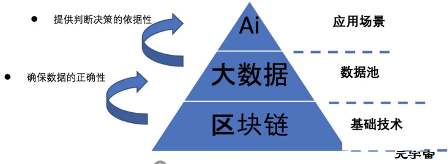

Kepler Finance 是涵盖全球的活跃区块链业务数据库，致力于为投资者提供专注 DLT、数字资产领域的综合数据。查询活跃的企业、团队、顾问、投资者、区块链上交易等的最完整列表。

【动态 | John McAfee提高其对比特币2020年底价格的预测】杀软件之父、加密货币支持者John McAfee此前曾预测，到2020年底，比特币的价格将超过100万美元。然而，在最近接受AIBCSummit的采访时，McAfee似乎提高了其预测数字，他说了下面这句话:“如果比特币到2020年底还无法达到200万美元，那么数学本身就很令人失望。比特币只有2100万枚，其中700万永远地消失了，如果中本聪死了，这一数字将继续增加。”（EWN）。

【最近1小时合约市场爆仓超1.16亿美元 BTC爆仓超3457万美元】据合约帝行情统计报告显示：最近1小时合约市场全网总计爆仓1.16亿美元，其中BTC爆仓3457万美元，ETH爆仓4066万美元，EOS爆仓2429万美元。

【动态 | BTC24小时资金净流入17.48亿元】根据AICoin数据显示，24小时资金净流入排名中BTC排名第一， 24小时净流入17.48亿元人民币；ETH24小时资金净流入排名第二，24小时净流入14.13亿元人民币;EOS24小时金净流入排名第三，24小时净流入6.07亿元人民币。LTC24小时资金净流入排名第四，24小时资金净流入4.61亿元人民币；ETC24小时资金净流入排名第五，24小时资金净流入2.32亿元人民币。

【商务部原副部长魏建国：未来新型的消费革命要与区块链等相结合】中国国际经济交流中心副理事长、商务部原副部长魏建国刊文表示，未来新型的消费革命要与区块链、云计算、大数据、智能化、物流配送、金融服务相结合。消费可以融合发展，直接影响生产资料的采购销售，带动生产部门、实体经济、中小企业的发展，以及中西部市场的发展。。

【西安抓获虚拟货币BRTR嫌疑人，涉案金额达500亿元】西安高新区局9月2日抓获虚拟货币案相关嫌疑人。该团伙此前在网上发布虚拟货币BRTR的相关虚假信息，引诱群众购买，短短一个月金额已达500余万元。办案民警根据前期收集到的侦查线索及嫌疑人供述，已将500余万元涉案资金全部追回并依法冻结。目前，此案还在进一步审理中。

【分析 | 建议交易者轻仓过节 避免节日期间行情异动】据Bgain Digital投研数据：截止北京时间2020年1月23日18:00点，BTC价格8469美元，24小时内BTC价格下跌2.51%，结合量化交易的BTC本位增强指数均略有下跌，其中Bgain交易指数下跌0.19%，CTA指数下跌0.25%，对冲交易指数下跌0.08%。截至18点，OKEX精英用户多空占比为49%/47%；火币精英用户多空占比41%/58%，Bitfinex多/空保证金占比为82%/18%，BitMEX多空仓位占比为58%/42%，市场情绪相对看空。币价今日整体比较平静，尾盘时略有下跌，2小时内下跌幅度近2%，成交量逐日萎缩，近几日市场暂未受美股及A股市场下跌行情影响，建议交易者在轻仓过节，避免节日期间行情异动。