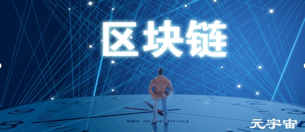

使用专有技术，Neutrino 开发了跨多个区块链监控、分析和跟踪加密货币流的解决方案，为整个加密货币生态系统提供了可操作的见解。现已被 Coinbase 收购。

我们大多数人都遇到过围绕**比特币**的所有谈论，一些预测声称法定货币和黄金可以完全替换，以便存储价值或支付交易，并且由于供应有限，比特币的价值可能达到天文数字的高度！在本文中，我们将旨在揭开区块链的神秘面纱，这是一种为比特币提供动力的技术，因此您可以对这项技术的革命性发表自己的看法！

所以我们可能想知道，**区块链**有什么特别之处？为什么一些最聪明的人，包括许多大公司的首席执行官认为，区块链在改变我们的世界方面拥有巨大的希望，并且开发这项技术的投资不断增加。

理解区块链的一种简单方法是将其可视化为一个数据库，该数据库在许多参与者之间公开共享（尽管**区块链技术**也可以私下部署，因此访问受到限制）。这些参与者中的每一个都通过他们的计算机连接到该网络，并且所有这些参与者都保持该数据库的相同副本。因此，区块链的核心基本原则之一是信息是透明的，同时可供网络中的所有参与者使用。

比特币可以说是最着名的公共区块链之一。它主要使用区块链技术为其用户提供**数字货币**，可用于支付产品和服务，就像普通货币一样，或充当价值储存。任何人都可以加入比特币网络，因为它可以向公众开放。

## 区块链的主要特点

如果区块链只是一个数据库，那么它有什么特别之处？我们有数百种不同的数据库技术。为了回答这个问题，让我们探讨一下区块链技术独有的一些特殊功能：

- **信息安全**
  区块链是一个加密安全的数据库。为了向数据库读取或写入信息，用户必须具有正确的加密密钥。密钥是成对的：标识数据库的公钥和确保只有适当的参与者才能更新数据库中的信息的私钥。这可确保有意阅读和/或更新信息的人可以获得信息。此外，还可以私下部署区块链以选择参与者，进一步限制访问谁可以查看和/或更新区块链上的信息。
- **分布式和分散化**
  区块链的另一个核心功能是它没有单点故障。如果在区块链网络上的一个或多个节点上发生故障，则其他节点仍保留数据并且网络继续运行。通过扩展，这意味着区块链是分散的;没有一个实体“拥有”网络。区块链通常被称为分布式分类账，因为信息驻留在对等网络上的多个设备上，其中每个设备复制并保存分类账的相同副本并独立更新。
- **防篡改**
  区块链的名称源于这样的事实：数据被存储为信息块，并且这些块以类似“链”的方式链接在一起。新信息基本上作为一个块一起更新并附加到以前的版本，创建一个不可变的防篡改记录。 区块链的这个属性使它在必须保留信息而不做任何改动的情况下非常有用。
- **共识驱动**
  除非大多数参与者检查并验证使用的凭据，否则无法在区块链上更新信息。这种共识驱动的模型基本上确保没有一个实体可以控制数据并创建欺诈性交易。

虽然区块链技术在某些方面可能无法与传统数据库相媲美，但它确实具有使其成为理想的独特功能。让我们探讨一下区块链技术可以推动创新解决方案并解决社会面临的关键问题的一些用例。

## 区块链的关键用例

区块链可以被认为是交易的数字日志，可以用于尚未完全实现数字价值的各种用例。目前全世界正在开发数百个粒度用例。下面，我们将尝试指出一些关键用例。

- **实时可追溯性**
  在现实世界中，构建对象或动作的可追溯性是相当困难的。例如，在零售行业，全面了解供应链流程有时是一个巨大的挑战。当产品质量或安全问题发生时，很难追踪和召回受影响的产品，或找不到负责任的实体。另外。信息通常存在伪造和篡改的风险。区块链技术可以通过分布式账本提供透明且不可变的信息记录来解决所有这些问题。
- **数字记录保存/数字身份**
  许多情况都需要具备永久数字记录的能力。例如，一个城市可能希望保留居民的所有权登记。区块链技术可以真正帮助记录此类信息，并确保信息保持不变，并且授权人员可以访问。同样，区块链技术也可用于在分布式账本上创建人或公司的不可变数字身份。
- **智能合约**
  区块链技术最有前途的用例之一是实施智能合约。一旦满足某些条件，智能合约就可以自动执行，从而促进合同中的某些交易，而无需第三方的任何外部输入。智能合约的应用范围很广，包括金融交易，资产和证券管理，法律事务等。