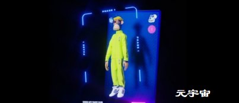

不可替代通证 NFT 市值，以及全球顶尖的不可替代通证项目索引，加密数字藏品的数据统计和工具。

基于区块链的非同质化通证（NFT）是一种记录在区块链上的数字资产所有权，具有唯一性、不可替代性、不可分割性等特征。作为智能经济中的核心要求，NFT目前已被广泛应用于收藏品、加密艺术品和游戏中。首先介绍NFT的相关概念、特征和发展历程，分析NFT的核心要素和典型应用领域，并指出目前NFT在产权、价值、技术、监管等方面面临的问题与风险；然后介绍NFT的研究现状，并在此基础上提出NFT在价值评估、交易模式与定价机制方面的研究问题；最后对NFT驱动的数字资产化趋势进行展望。

元宇宙与NFT的联动开辟了市场，带来一片繁荣景象，而虚拟世界与现实世界联动的同时，也应受限于现实世界的法律规定，从而保证虚拟财产交易市场的健康稳定发展。当然，作为全新的领域，元宇宙与虚拟财产的碰撞将会产生更多的火花，也期待立法的完善与进步，能够弥补这部分的空白。

加密货币和稳定币没落之后，NFT 会发生什么？

　　什么将推动 NFT 强势回归。

　　不可替代代币（NFT）的批评者长期以来一直警告说，当前的NFT狂热是暂时的。目前，有越来越多的证据支持他们的说法。

　　根据市场追踪机构 NonFungible的说法，不可替代代币的典型购买价格现在不到 2,000 美元。这比 1 月份大约 6,800 美元的总额有所减少。此外，总销售额已从 1.6 亿美元降至 2600 万美元。

　　结果，NFT 的直销从 1 月份的每天约 26,000 个暴跌至不足 3,200 个。与年初相比，这意味着销售额大幅下降。二级市场的日销量已从 1 月份的 38,000 辆降至刚刚超过 7,900 辆。

　　直销在去年 8 月达到 795,000 的峰值，而二级销售额在去年 9 月达到创纪录的 103,765。一些最著名的NFT的价值正在下降。周五早上以 224,028.62 美元出售的无聊猿游艇俱乐部 NFT 似乎是一笔大笔交易。然而，在 1 月底收购它的客户损失了 67,799.54 美元。

　　几年前，CarMax 和 Take-Two Interactive Software 的总市值为 230 亿美元，超过了不可替代的代币。根据 CoinMarketCap 的数据，截至目前刚刚超过 100 亿美元

　　通货膨胀、乌克兰战争以及美国证券交易委员会对 NFT 更严格的监控似乎都促成了不可替代代币价格的下跌。

　　怀疑论者并不是唯一预测 NFT 消亡的人。最热情的数字艺术收藏家预测“灾难性的市场崩盘”。他们认为，由于 NFT 的多功能性和可负担性，市场将变得不堪重负。

　　鉴于持续的低迷，这种巨大的变化尚未发生。与 Cryptos 相比，最大的不可替代代币资产今年表现更好。

　　与加密货币一样，NFT 将受到更多规则的约束。例如，美国 SEC 正在调查 NFT 开发商以加强市场监管。

　　不可替代的代币自动售货机制造商 Neon 认为，炒作周期正在放缓，让更多价值 NFT 脱颖而出。同时，目前的情况允许霓虹公司随着市场的调整进行盘点。

　　NFT 领域正在发生转变。通过一级市场力量或恐慌的普遍降温，从长远来看，降温对空间是有利的。热潮减少可能是一个好兆头。这意味着人们开始现实地看待这个行业。

　　根据 Neon 联合创始人 Jordan Birnholtz 的说法，NFT 经历了两个重大的结构变化。首先，消费者拒绝嗡嗡声和FOMO与内容创作者的实际联系。此外，个人专注于构建具有真正实用性的代币；因此，他们通过创建高价值、制作精良的代币来利用空投和薄荷糖。随着技术和艺术走在最前沿，Birnholtz 相信人们对 NFT 市场的兴趣将会重新抬头。

　　这些不可替代的代币问题并非不可克服。具有启发性和富有的利益相关者的改进用例将有助于推动更高的创新。在这方面，体育界为了解 NFT 的未来提供了一个窗口。除了门票销售，体育组织还通过销售产品从粉丝那里获取价值。

　　借助 NFT，粉丝团队互动可以变得更加复杂。这可能会启用经典的货币化方法，例如商品和门票销售。此外，它还允许新的场景，如元宇宙联盟和收藏品交换。像 Autograph 这样的初创公司已经在追求体育纪念品。

　　NFT 有可能不仅仅是记忆的存储介质。想象一下，一位切尔西球迷正在观看 2021 年切尔西和曼城之间的欧冠决赛。尽管它会永远铭刻在目睹者的脑海中，但这场胜利的意义在终场哨响后就消失了。