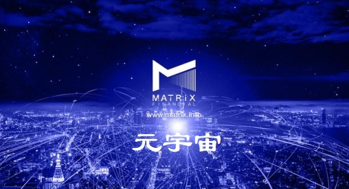

Token Analyst 实时追踪链上交易量，以获得加密数字生态系统的最全面画像；了解给定通证的所有权基础的集中化程度，特别是项目团队和早期投资者持有多少；监控大户地址交易，未反映在交易平台但在链上可见的交易类型。

只有结合上区块链的token，才具备三要素的特性：

**1、数字权益证明，**通证必须是以数字形式存在的权益凭证，代表一种权利、一种固有和内在的价值；

**2、加密，**通证的真实性、防篡改性、保护隐私等能力由密码学予以保障；

**3、可流通，**能够在一个网络中流动，从而随时随地进行验证。

事实上，通证可以代表一切权益证明，从身份证到学历文凭，从货币到票据，从钥匙、门票到积分、卡券，从股票到债券，人类社会全部权益证明，都可以用通证来代表。

在智能合约时代，区块链最重要的应用就是价值在互联网上直接流通。通过实体或虚拟资产的token化，将资产上链，实现资产的液化，能直接通过网络来跨国界、短时差、低成本进行资产交易与转移。资产液化能将资产进行分割，在链上进行全世界的流通，能打破地域局限。而平台通过token化，一方面可以进行平台融资，为平台的启动和发展募集资金；另一方面，在链上产生用于资产交易的价值中介，实现链上资产P2P自由交易和流通，打破了货币兑换的限制。

**Token分类**目前市场上的Token分类标准多种多样，有从本质上划分，也有从发行模式和价值来源划分，本文主要从应用场景的不同进行划分，作为参考。

**传统资产类Token**

传统资产Token指的是使用密码学方法表示的传统资产，例如股权、房产、黄金等，Token本身有明显的基本价值。Token化的传统资产价值很好理解，资产价值的讨论不在本文范围之内。我们会看到随着监管逐渐透明化，因为区块链上Token的良好流动性和全球性特征，传统资产类Token会激增。

**应用类Token**

应用类Token，可以提供一种数字化服务。使用项目的服务必须持有Token。只要数字化服务在某种程度上有用并且是由稀有且唯一的资源集支撑的，代表数字化服务的Token的价值就会持续存在。应用类Token的基本价值是由所代表的数字化服务的资源唯一性和去中心化数字服务本身的有用性决定的。

**工作类Token**

工作类Token能够赋予Token持有者向一个去中心化组织贡献工作的权利，帮助去中心化组织正常运转。在有些情况下，这种工作会得到一定的回报，但有时不会。工作类Token的基本价值是由Token持有者从去中心化组织中获得的效用决定的。此处的效用可以以费用的形式（更为直接的效用）或美好的意愿（间接效用）。

**通证经济**通证经济（Token Economy），即把通证充分用起来的经济。主要从几个维度去考量。

第一，供给侧，通证的供给充分市场化，高度自由，任何人、任何组织、任何机构都可以基于自己的资源和服务能力发行权益证明，而且通证是运行在区块链上，随时可验证、可追溯、可交换，其安全性、可信性、可靠性是以前任何方式都达不到的。所以每一个组织和个人现在都可以很轻松的把自己的承诺书面化、“通证化”、市场化。这是人类社会从来都没有的能力。

第二，流通速度，这是个关键。区块链上的通证可以比以前的卡、券、积分、票快几百几千倍的流转，而且由于密码学的应用，这种流转和交易极其可靠，纠纷和摩擦将成几百几千倍的降低。如果说在传统经济时代，衡量整个社会经济发展的一个重要指标是货币流转速度，而在互联网经济时代衡量一个国家、一个城市发达程度的一个重要指标是网络流量，那么在互联网+经济的时代，通证的总流通速度将成为最重要经济衡量指标之一。当我们每个人、每个组织的各种通证都在飞速流转、交易的时候，我们的生产和生活方式将完全改变。

第三，价格发现，由于通证高速流转和交易，每一个通证的价格都将在市场上获得迅速的确定，这个就是通证经济的看不见的手，它比今天的市场价格讯号要灵敏和精细几百几千倍，它将把有效市场甚至完美市场推到每一个微观领域中。

第四，通证应用，也就是围绕通证的智能合约应用。仅此一项，就可以激发出千姿百态的创新，它创造的创新机遇、掀起的创新浪潮，将远远超过先前计算机和互联网时代的总和。基于这四点认识，我坚信通证是将我们导向下一代互联网新经济的关键。

**设计通证经济体系**

通证派创始人之一的王玮认为通证最终如何设计，取决于你的目的是什么，是想打造生态，还是满足当下的融资。即通证经济体系的设计逻辑取决于设计者的核心诉求。为此，他对通证从不同维度进行了划分：

第一种是价值型，它直接对应某种价值，比如这个通证值一千块钱，你可以用来做储值卡或者兑换券；

第二种是收益型，也就是说这个通证本身不值一百块钱，但未来可以持续产生收益，比如说股票、债券；

第三种是权利型，是指持有人在特定应用场景获得的权利或权益，比如贵宾卡、优惠卡；

第四种是标识型，是指本身不具有价值，但是某种有价资产或客观事实的标识，比如老年证、房产证。

在设计通证经济体系之前，还要思考三个问题：

1、流通的价值，作为价值的载体，通证如何通过流通产生更高的价值？它们的价值来源是什么？以不良资产为例，通证化的价值可能是在二级市场找到更多的买家。如果我们设计的通证有利于市场主体在经济活动中发现需求或者降低成本，那就进行通证化。

2、为谁创造价值，通证的经济体系中包括资产发行方、消费者、中介等角色，但有时候通证经济体系的设计不一定能满足所有人的利益。

3、流通的边界在哪里？区块链技术可以让通证突破所有边界，但是你的通证是不是需要跨边界流通？不同属性的通证之间的兑换模型存在不确定性或者因环境而变化，甚至无法形成兑换关系，那么跨边界的流通有什么作用？总之，如何确定流通边界，对于通证经济体系的设计，以及是否要用区块链来实现，有很大的影响。

**通证经济面临的挑战**

第一是技术层面的挑战，因为它不仅仅是一个信息泄露的风险，它是金融和资产的风险；

第二是监管的挑战；

第三是场景的挑战。

**技术层面。**早期技术还不够成熟，进而会导致金融方面的风险。例如如果互联网出现了漏洞，比如网站被攻击，最多造成信息泄露，个人数据被贩卖。但是，我们把这个问题放在区块链上，要严重非常多。因为它不仅仅是信息泄露的问题，它有可能带来直接的资产损失问题。所以说，构建价值互联网遇到的挑战和复杂性，比构建信息互联网要多很多，而且出现问题后，付出的代价也会非常大。

**监管问题。**包括整个政策，法律，包括行业的自律问题。比如ICO问题，ICO在去年是一个非常大的狂潮，很多空气币发出来，通过白皮书就募到了很多钱。投机炒作泡沫的问题,是对监管的一个挑战。让Token经济大潮能快速到来，在进一步推动人类经济的交换、推动生产力的同时，也要避免这个阶段出现大量的欺诈行为。

**场景的挑战。**之前所谓的链圈，他们找的很多场景，都是有问题的，不需要区块链的，非要去套一个区块链。因此，大家在摸索的时候，如何能够发现真正有价值的场景，这也是个挑战。

**对于通证未来的展望**

未来，通证生态系统很可能就像今天的互联网生态系统一样，渗透到我们未来生活的每一个角落。通证经济将是区块链技术和通证共同发展且以通证为核心的生态系统，一方面，未来可能将继续开展“去中心化”的进程，区块链参与者的自治程度将不断提高，但是另一方面，未来的通证生态系统仍将在政府和法律的监管之下，“无政府”的通证生态不是未来通证生态的主流形态。